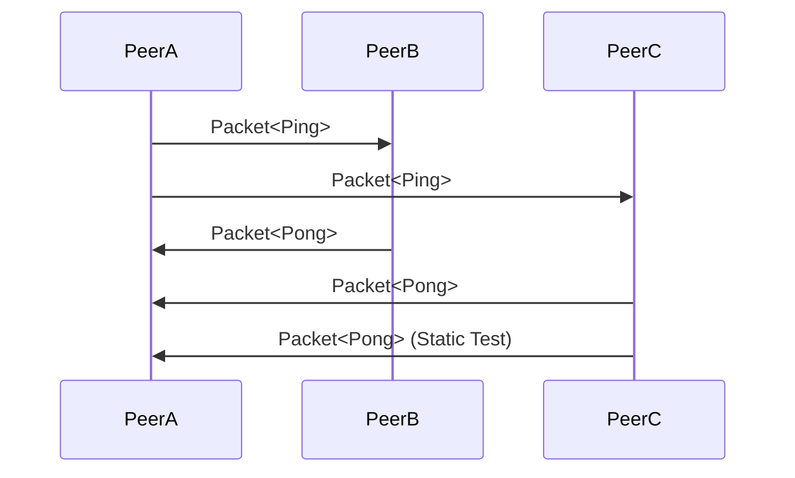
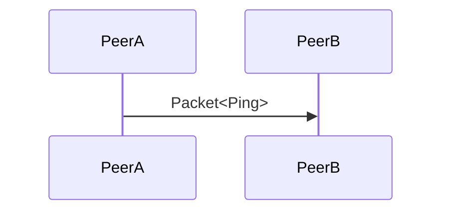
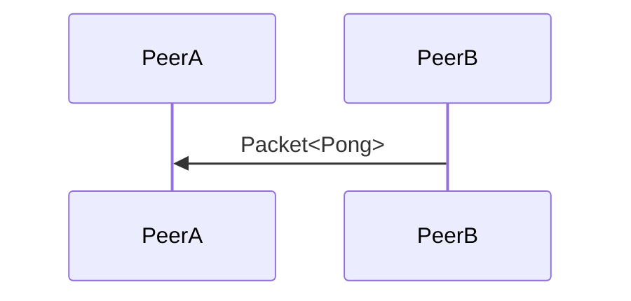
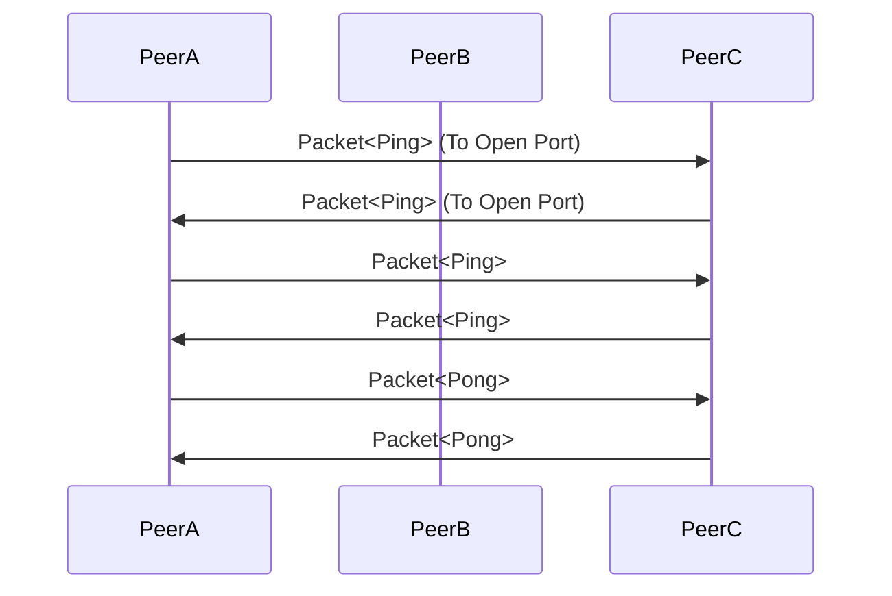
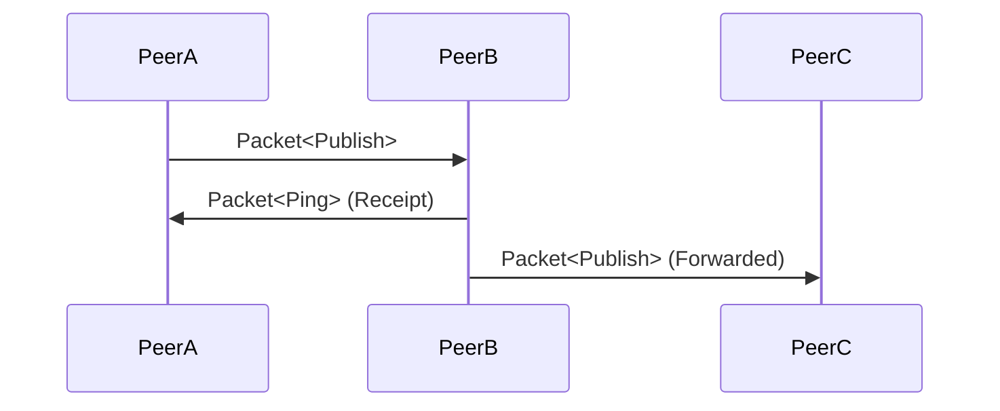
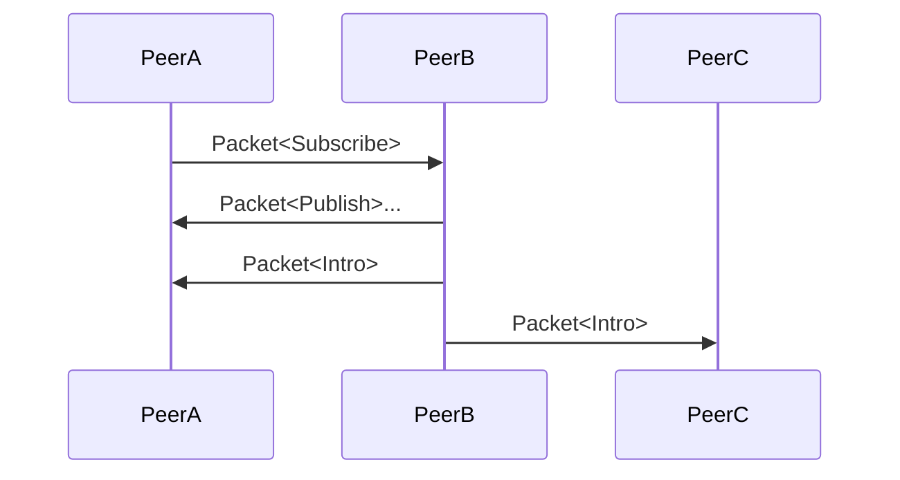

# About

This document tries to describe the intended `behavior` of program execution.
A behavior is defined as a sequence of `states`. A state is the assignment of
values to varaibles. A program is modeled by a set of behaviors: the bahaviors
representing all possible executions.


# Data Types

- LET `SHA256` be a 32 byte buffer
- LET `PACKET_TYPE` be a 4 byte buffer
- LET `NAT_TYPE` be a string of either `easy` | `hard` | `static`
- LET `PEER_STATE` be a string of either `active` | `gone` | `inactive` | `missing`
- LET `IP_ADDRESS` be a valid IP address (IPv4 or IPv6)
- LET `PORT` be a valid socket port (between 1 and 65535)
- LET `MESSAGE` a 1024 byte buffer

```c++
struct Packet { // A packet is a doubly-linked list, like a verifiable link in a chain
  PACKET_TYPE type;
  SHA256 packetId; // the sha256 hash of (previousId + nextId + message)
  SHA256 topicId;
  SHA256 previousId;
  SHA256 nextId;
  MESSAGE message;
};
```

```c++
struct Peer {
  string address; // the ip address of the peer
  uint16_t port; // the numeric port of the peer
  char[32] peerId; // the unique id of the peer
  NAT_TYPE natType; // a NAT_TYPE 
  string state;
  array<SHA256> topics;
  string pingId; // the last pingId received from this peer
  timestamp lastUpdate; // unix timestamp
};
```

# Variables

- LET `KEEP_ALIVE` be the average time that a [NAT][W1] retains a port mapping
- LET `PEERS` be a list of `Peer` to connect to (read from disk or hard-coded)
- Let `TOPICS` be a list of topic ids for a peer to subscribe to (read from disk or hard-coded)


# States

All states are applicable to all peers, a peer MUST not have unique properties
or states in order to maintain network symmetry.

## `STATE_0` (Initial)

### Description

Initially, `Peer A` may not be addressable directly (because of its NAT).
However, the details needed to address it can be discovered by coordinating with
other peers located outside its NAT.

Coordination starts when peer `A` sends a packet to peer `B` and peer `C`.
`B` responds to `A` with `A`'s public-facing [`IP_ADDRESS`][W2] and
[`PORT`][W3]. If `C` also responds with the same address and port, `A`'s
`NAT_TYPE` is `easy`. If the port number is different, `A`'s `NAT_TYPE` is
`hard`. If `C` can send a packet directly to `A` on a well-known port,
`A`'s `NAT_TYPE` is `static`.

Here's an analogy. You don't know what you look like, but a mirror can tell you.
If you look in a second mirror and see the same thing, you know the first mirror
is correct.

### Topology



### Procedure

- Request this peer's `NAT_TYPE`, external `IP_ADDRESS` and `PORT`
  - Select 2 random peers from `PEERS` with a `NAT_TYPE` that is `easy` or `static`
    - Send each peer `Packet<Ping>`
  - Expect each peer that receives the packet to GOTO `STATE_1`
  - Wait for `STATE_2` to complete

- AFTER `STATE_2` has completed, start an interval of no more than `KEEP_ALIVE`
  - Request this peer's `NAT_TYPE`
  - For each known `Peer`
    - IF `now` - `peer.lastUpdate` > (`KEEP_ALIVE` * `5`), LET `peer.state` be `gone`
    - IF `now` - `peer.lastUpdate` > (`KEEP_ALIVE` * `3`), LET `peer.state` be `missing`
    - IF `now` - `peer.lastUpdate` > (`KEEP_ALIVE` * `1.5`), LET `peer.state` be `inactive`
    - ELSE GOTO `STATE_1`
  - For each cached `Packet`
    - IF the packet has expired (`packet.timestamp` > `now` - `packet.ttl`)
      - Decrement `packet.postage` (which starts at `8`) by one
      - IF `packet.postage > 0`
        - Rebroadcast to at least 3 peers
      - ELSE delete the packet from the cache

## `STATE_1` (Ping)

### Description

When a peer sends a `Packet<Ping>` and it is received, the Ping sequence
is started.

```c++
struct Ping extends Packet {
  SHA256 messageId;
  SHA256 previousId; // optional
  SHA256 topicId; // optional
  SHA256 nextId; // optional
  uint8 type = 1;
  struct message {
    bool isReflection = false; // optional
    bool isConnection = false; // optional
    string natType; // optional
    SHA256 peerId;
    SHA256 requestId;
    vector<SHA256> topics;
    uint16 testPort; // optional
  }
}
```

### Topology



### Procedure

- LET `PORT` be the port that is provided by the socket
- LET `IP_ADDRESS` be the address that is provided by the socket
- LET `p` be the received `Packet<Ping>`

- IF `p.message.isReflection` is true, send `Packet<Pong>` to `IP_ADDRESS` on `PORT`
  - IF `p.message.testPort` is a valid port
    - Send `p` to `IP_ADDRESS` using `testPort` instead of `PORT`


## `STATE_2` (Pong)

### Description

AFTER a peer sends `Packet<Ping>`, it should expect to receive `Packet<Pong>`.

### Topology



### Procedure

TODO


## `STATE_3` (Introduce)

### Description

Peer `A` may want to connect directly to peer `B` if they both subscribe
to the same topic. In `STATE_5` the two peers are "introduced", meaning they
now both know each other's external facing ip and port. The next part of the
process is known as [hole punching][W4]. The peer doing the introduction
will send a `Packet<Intro>` to `A` with the public `IP_ADDRESS` and `PORT`
of `B`, and at the same time send `B` the public `IP_ADDRESS` and `PORT` of `A`.

The first ping does not expect a response. It is only sent to open a port.

> NOTE Support for port mapping protocols is scheduled for version 2 of this protocol.

### Topology



### Procedure

- LET `p` be the received `Packet<Intro>`

- IF this `NAT_TYPE` is `easy` AND `p.message.natType` is `easy` OR `static`
  - send `Packet<Ping>` to the peer at `p.message.address` on `p.message.port`
- IF this `NAT_TYPE` is `easy` AND `p.message.natType` is `hard`, apply [BDP][E0] strategy ("easy" side)
  - Send `n` `Packet<Ping>` messages from our main port to unique random ports at `p.message.address`. On average it will take about `+/- 250` packets. Sending only `250` packets would mean that the connection succeeds 50% of the time, so try at least `1000` packets, which will have a 97% success rate. Give up after that in case the other peer was actually down or didn't try to connect. These packets should be sent at a short interval (ie, `10ms`). This gives time for response messages. If a response is received then stop.
- IF this `NAT_TYPE` is `hard` AND `p.message.natType` is `easy`, apply [BDP][E0] strategy ("hard" side)
  - Send `256` `Packet<Ping>` from unique random ports to `p.message.port`. This means binding `256` ports. The peer may reuse the same ports for subsequent requests. These packets are necessary to open the firewall for the easy side, and should be sent immediately.
    - `.peerId` MUST be set to this `.id`
    - `.natType` MUST be set to this `.nat`
- IF this `NAT_TYPE` is `hard` AND `p.message.natType` is `hard`
  - Forward `Packet<Intro>` to other peers who have a `NAT_TYPE` that is NOT hard


## `STATE_4` (Publish)

### Description

A peer that wants to send a message to another peer may not send the message
directly to that peer. This is because that peer may become unreachable at
any time. Instead, a peer publishes a `Packet<Publish>` packet to the network.
This packet may be received by one or more other peers. Eventually it will
be received by the intended recipient who also subscribes to the topic.

### Topology



### Procedure

- `Peer A` prepares a `Packet<Publish>`
  - LET `.topicId` be the topic the peer is publishing to


## `STATE_5` (Subscribe)

### Description

When a peer sends the `Packet<Subscribe>` packet and it is received, the
Subscription sequence is initiated. This is generally the first step in
joining a network. This procedure will introduce peers and prompt them to
goto `STATE_3` (Introduction).

### Topology



### Procedure

- LET `p` be `Packet<Subscribe>`
  - LET `p.message.topicId` be the topic the peer wants to subscribe to
  - LET `p.message.packetIds` be an array with zero or more `packetId`s
- `Peer A` sends `p` to `Peer B`
  - `Peer B` MAY respond with all cached packets if `p.message.packetId` is not specified
  - `Peer B` prepares `Packet<Intro>` for each peer who subscribes to `topicId`

# Notes & Citations

> NOTE This work derives from the paper published by Bryan Ford (<baford@mit.edu>), Pyda Srisuresh (<srisuresh@yahoo.com>) and Dan Kegel (<dank@kegel.com>) entitled "[Peer-to-Peer Communication Across Network Address Translators][E1]".

[W0]:https://en.wikipedia.org/wiki/Maximum_transmission_unit
[W1]:https://en.wikipedia.org/wiki/Network_address_translation
[W2]:https://en.wikipedia.org/wiki/IP_address
[W3]:https://en.wikipedia.org/wiki/Port_(computer_networking)
[W4]:https://en.wikipedia.org/wiki/UDP_hole_punching
[E0]:https://tailscale.com/blog/how-nat-traversal-works/
[E1]:https://pdos.csail.mit.edu/papers/p2pnat.pdf
